# 🏗️ Architecture Documentation: Natural Language to MongoDB Query System

> **Purpose**: This document provides deep function-level architecture diagrams to help understand the system's design and data flow for future reference.

---

## 📊 System Overview

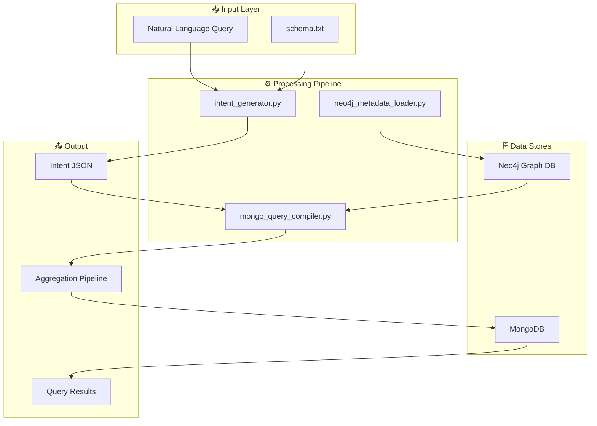

---

## 1️⃣ Intent Generator Module (`intent_generator.py`)

This module converts natural language questions into structured Intent JSON using OpenAI's API.

### High-Level Flow

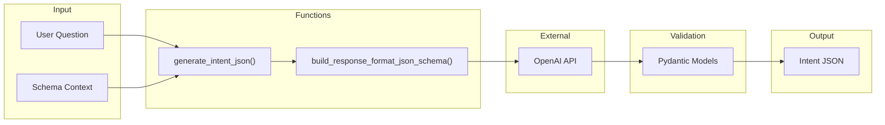

### Function Details

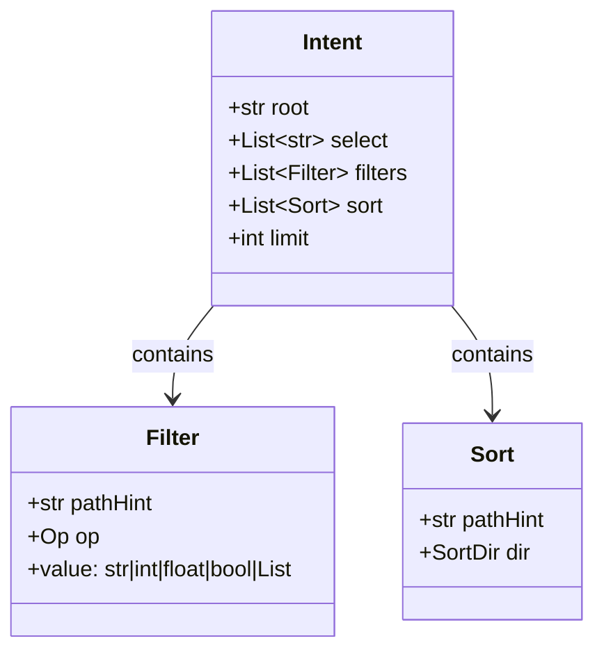

### `generate_intent_json()` Function Flow

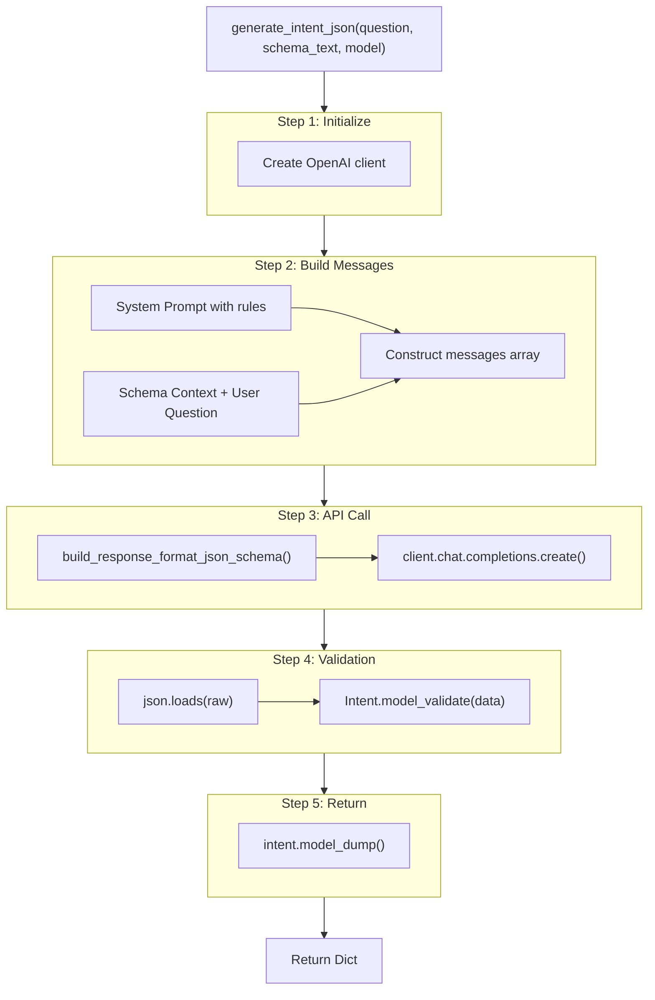

---

## 2️⃣ Neo4j Metadata Loader Module (`neo4j_metadata_loader.py`)

This module loads schema metadata into Neo4j to enable dynamic join discovery.

### Graph Schema

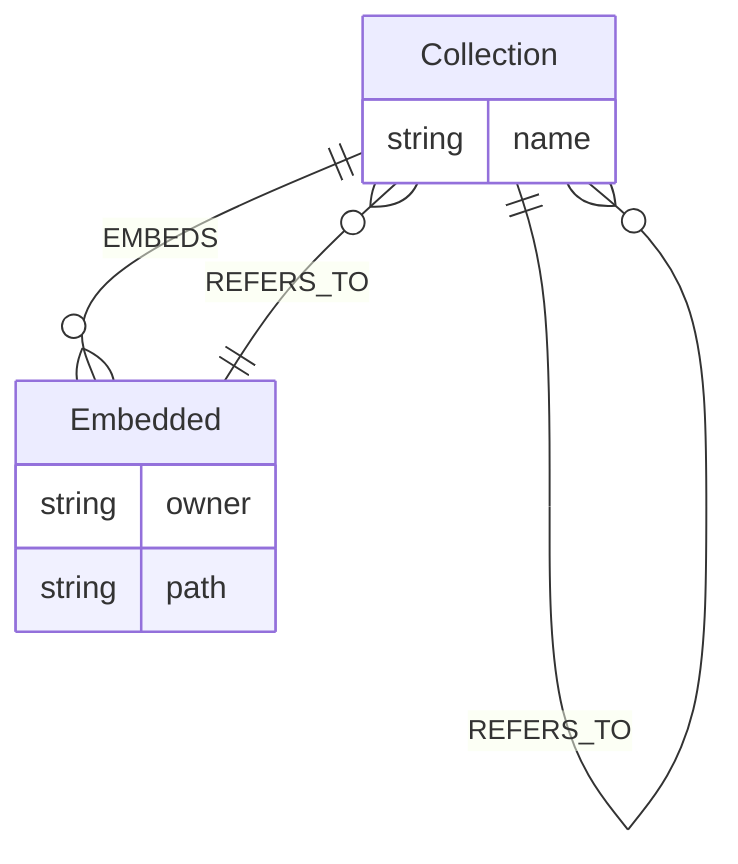

### Data Structures

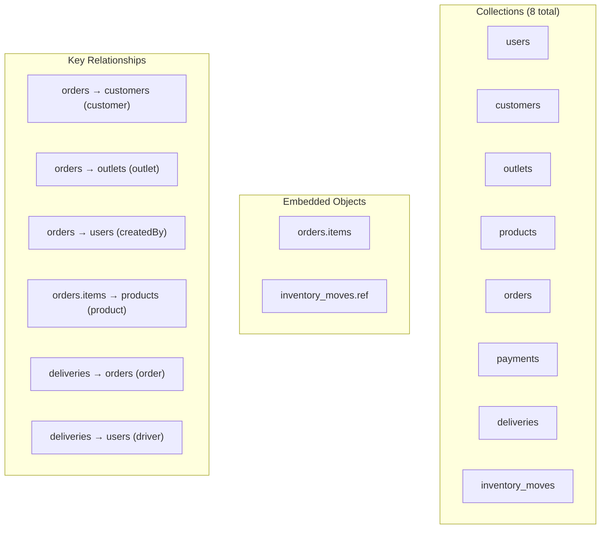

### `load_metadata()` Function Flow

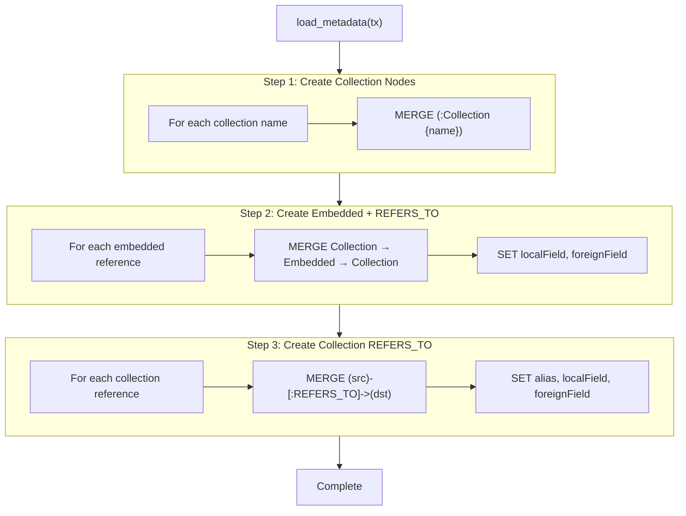

### Neo4j Graph Visualization

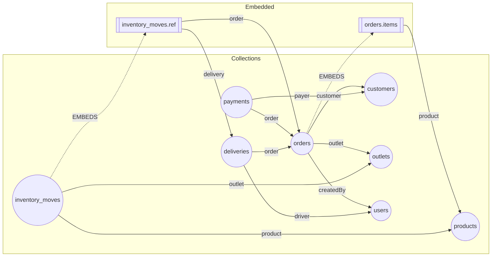

---

## 3️⃣ MongoDB Query Compiler Module (`mongo_query_compiler.py`)

This is the core module that compiles Intent JSON into MongoDB aggregation pipelines.

### High-Level Architecture

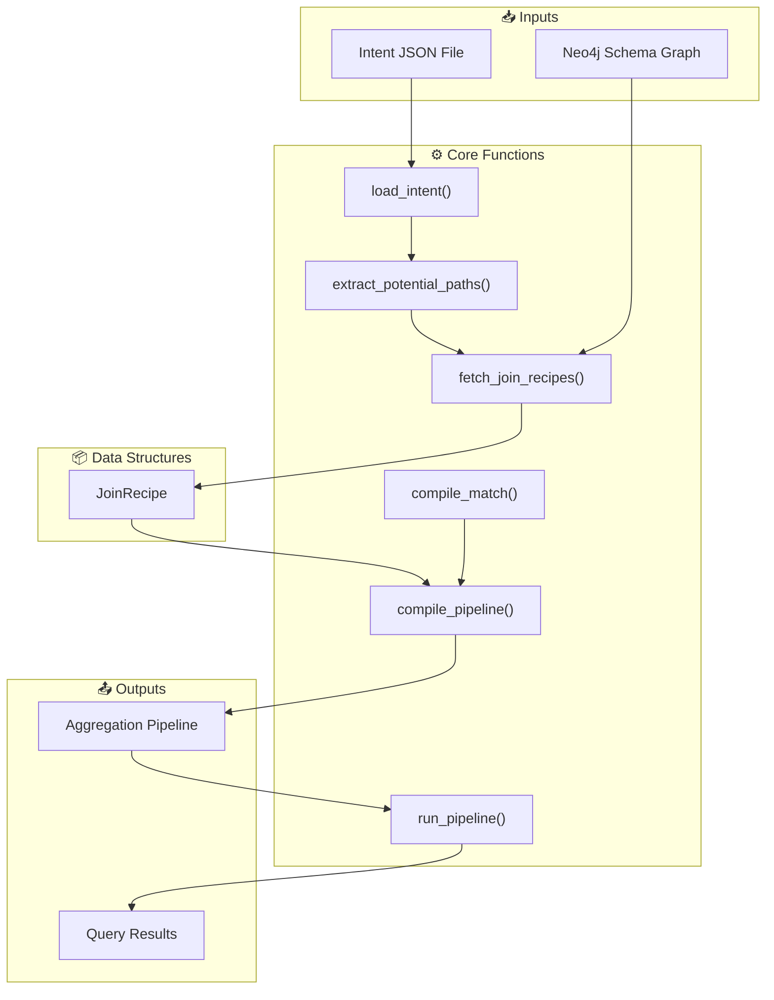

### Data Structure: `JoinRecipe`

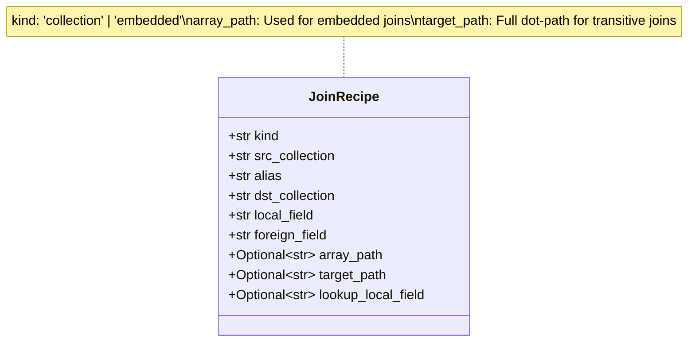

### Function: `load_intent()`

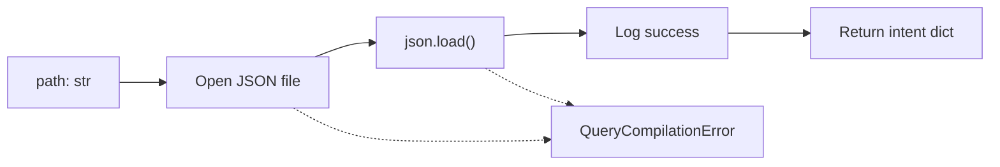

### Function: `extract_potential_paths()`

Extracts all dot-notation paths referenced in the intent to discover required joins.

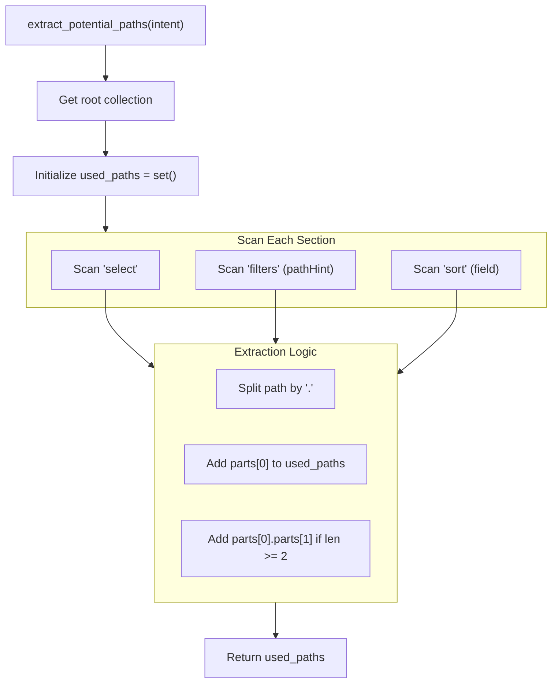

**Example:**
```
Input: select = ["orderNo", "customer.name", "items.product.name"]
Output: {"orderNo", "customer", "customer.name", "items", "items.product"}
```

### Function: `fetch_join_recipes()`

Discovers join recipes from Neo4j based on potential paths.

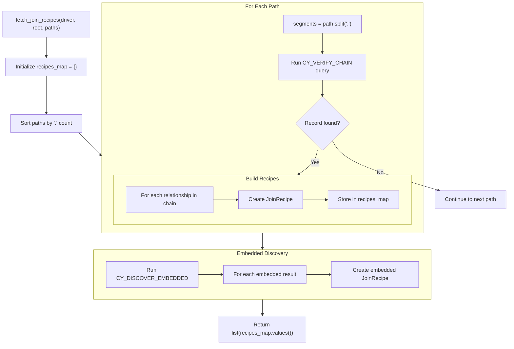

### Neo4j Cypher Queries

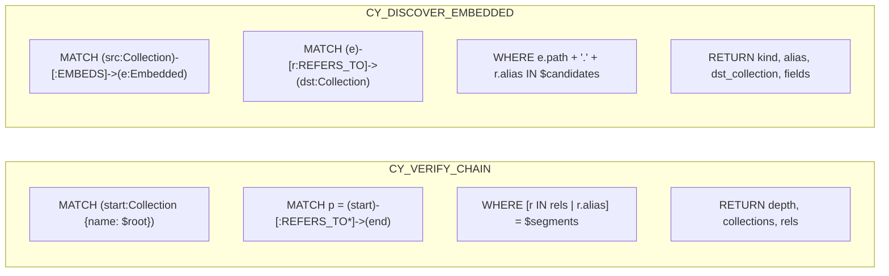

### Function: `compile_match()`

Converts filters to MongoDB `$match` stage with path rewriting.

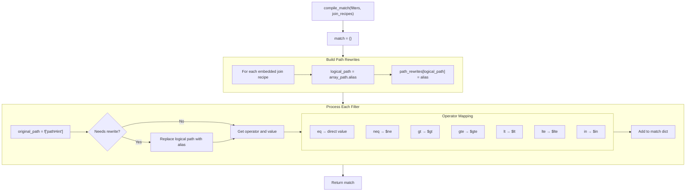

**Path Rewriting Example:**
```
Input: "items.product.category"
Rewrite Map: {"items.product": "product"}
Output: "product.category"
```

### Function: `compile_pipeline()` - Main Compilation

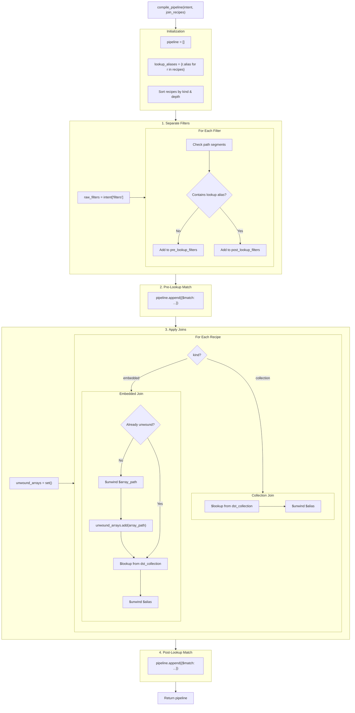

