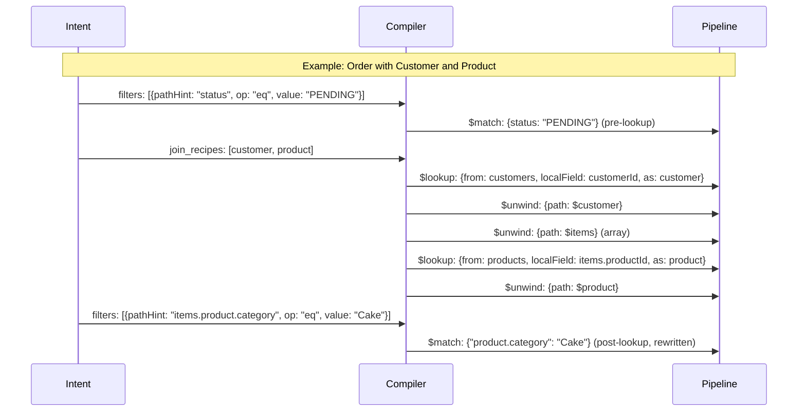
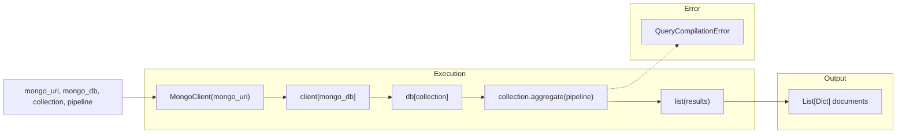
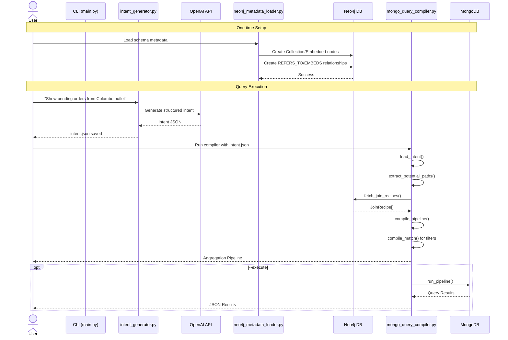

# 🏗️ Architecture Documentation: Natural Language to MongoDB Query System

> **Purpose**: This document provides deep function-level architecture diagrams to help understand the system's design and data flow for future reference.

---

## 📊 System Overview

```mermaid
flowchart TB
    subgraph Input["📥 Input Layer"]
        NL["Natural Language Query"]
        Schema["schema.txt"]
    end
    
    subgraph Processing["⚙️ Processing Pipeline"]
        IG["intent_generator.py"]
        NM["neo4j_metadata_loader.py"]
        MQC["mongo_query_compiler.py"]
    end
    
    subgraph Storage["🗄️ Data Stores"]
        Neo4j["Neo4j Graph DB"]
        MongoDB["MongoDB"]
    end
    
    subgraph Output["📤 Output"]
        Intent["Intent JSON"]
        Pipeline["Aggregation Pipeline"]
        Results["Query Results"]
    end
    
    NL --> IG
    Schema --> IG
    IG --> Intent
    Intent --> MQC
    NM --> Neo4j
    Neo4j --> MQC
    MQC --> Pipeline
    Pipeline --> MongoDB
    MongoDB --> Results
```



---

## 1️⃣ Intent Generator Module (`intent_generator.py`)

This module converts natural language questions into structured Intent JSON using OpenAI's API.

### High-Level Flow


### Function Details


### `generate_intent_json()` Function Flow


---

## 2️⃣ Neo4j Metadata Loader Module (`neo4j_metadata_loader.py`)

This module loads schema metadata into Neo4j to enable dynamic join discovery.

### Graph Schema


### Data Structures

```mermaid
flowchart TB
    subgraph Collections["Collections (8 total)"]
        U["users"]
        C["customers"]
        O["outlets"]
        P["products"]
        OR["orders"]
        PA["payments"]
        D["deliveries"]
        IM["inventory_moves"]
    end
    
    subgraph Embedded["Embedded Objects"]
        OI["orders.items"]
        IMR["inventory_moves.ref"]
    end
    
    subgraph Relationships["Key Relationships"]
        R1["orders → customers (customer)"]
        R2["orders → outlets (outlet)"]
        R3["orders → users (createdBy)"]
        R4["orders.items → products (product)"]
        R5["deliveries → orders (order)"]
        R6["deliveries → users (driver)"]
    end
```



### `load_metadata()` Function Flow

```mermaid
flowchart TD
    Start["load_metadata(tx)"]
    
    subgraph Step1["Step 1: Create Collection Nodes"]
        Loop1["For each collection name"]
        Merge1["MERGE (:Collection {name})"]
    end
    
    subgraph Step2["Step 2: Create Embedded + REFERS_TO"]
        Loop2["For each embedded reference"]
        Merge2["MERGE Collection → Embedded → Collection"]
        Set2["SET localField, foreignField"]
    end
    
    subgraph Step3["Step 3: Create Collection REFERS_TO"]
        Loop3["For each collection reference"]
        Merge3["MERGE (src)-[:REFERS_TO]->(dst)"]
        Set3["SET alias, localField, foreignField"]
    end
    
    Start --> Step1
    Loop1 --> Merge1
    Step1 --> Step2
    Loop2 --> Merge2 --> Set2
    Step2 --> Step3
    Loop3 --> Merge3 --> Set3
    Step3 --> End["Complete"]
```



### Neo4j Graph Visualization


---

## 3️⃣ MongoDB Query Compiler Module (`mongo_query_compiler.py`)

This is the core module that compiles Intent JSON into MongoDB aggregation pipelines.

### High-Level Architecture


### Data Structure: `JoinRecipe`


### Function: `load_intent()`


### Function: `extract_potential_paths()`

Extracts all dot-notation paths referenced in the intent to discover required joins.


**Example:**
```
Input: select = ["orderNo", "customer.name", "items.product.name"]
Output: {"orderNo", "customer", "customer.name", "items", "items.product"}
```

### Function: `fetch_join_recipes()`

Discovers join recipes from Neo4j based on potential paths.


### Neo4j Cypher Queries


### Function: `compile_match()`

Converts filters to MongoDB `$match` stage with path rewriting.

```mermaid
flowchart TD
    Start["compile_match(filters, join_recipes)"]
    
    InitMatch["match = {}"]
    
    subgraph BuildRewrites["Build Path Rewrites"]
        Loop1["For each embedded join recipe"]
        Create["logical_path = array_path.alias"]
        Store["path_rewrites[logical_path] = alias"]
    end
    
    subgraph ProcessFilters["Process Each Filter"]
        GetPath["original_path = f['pathHint']"]
        CheckRewrite{"Needs rewrite?"}
        Rewrite["Replace logical path with alias"]
        GetOp["Get operator and value"]
        
        subgraph OpMapping["Operator Mapping"]
            EQ["eq → direct value"]
            NEQ["neq → $ne"]
            GT["gt → $gt"]
            GTE["gte → $gte"]
            LT["lt → $lt"]
            LTE["lte → $lte"]
            IN["in → $in"]
        end
        
        AddMatch["Add to match dict"]
    end
    
    Return["Return match"]
    
    Start --> InitMatch --> BuildRewrites
    Loop1 --> Create --> Store
    BuildRewrites --> ProcessFilters
    GetPath --> CheckRewrite
    CheckRewrite -->|Yes| Rewrite
    CheckRewrite -->|No| GetOp
    Rewrite --> GetOp
    GetOp --> OpMapping --> AddMatch
    ProcessFilters --> Return
```



**Path Rewriting Example:**
```
Input: "items.product.category"
Rewrite Map: {"items.product": "product"}
Output: "product.category"
```

### Function: `compile_pipeline()` - Main Compilation


### Pipeline Stage Generation Detail



### Function: `run_pipeline()`



### Function: `main()` - CLI Entry Point

```mermaid
flowchart TD
    Start["main()"]
    
    subgraph Args["Parse Arguments"]
        MongoURI["--mongo_uri"]
        MongoDB["--mongo_db"]
        Neo4jURI["--neo4j_uri"]
        Neo4jUser["--neo4j_user"]
        Neo4jPass["--neo4j_password"]
        IntentFile["--intent_file"]
        PrintPipe["--print_pipeline"]
        Execute["--execute"]
    end
    
    subgraph Pipeline["Build Pipeline"]
        LoadIntent["intent = load_intent(path)"]
        ExtractPaths["paths = extract_potential_paths(intent)"]
        ConnectNeo4j["driver = GraphDatabase.driver(...)"]
        FetchRecipes["recipes = fetch_join_recipes(...)"]
        CompilePipe["pipeline = compile_pipeline(...)"]
    end
    
    subgraph Output["Output"]
        CheckPrint{"print_pipeline?"}
        PrintJSON["print(json.dumps(pipeline))"]
        CheckExec{"execute?"}
        RunPipe["results = run_pipeline(...)"]
        PrintResults["print(json.dumps(results))"]
    end
    
    subgraph Cleanup["Cleanup"]
        CloseNeo4j["driver.close()"]
    end
    
    subgraph Errors["Error Handling"]
        QCE["QueryCompilationError → exit(1)"]
        Other["Exception → exit(1)"]
    end
    
    Start --> Args --> Pipeline
    LoadIntent --> ExtractPaths --> ConnectNeo4j --> FetchRecipes --> CompilePipe
    Pipeline --> Output
    CheckPrint -->|Yes| PrintJSON
    CheckPrint -->|No| CheckExec
    PrintJSON --> CheckExec
    CheckExec -->|Yes| RunPipe --> PrintResults
    CheckExec -->|No| Cleanup
    PrintResults --> Cleanup
    Cleanup --> End["Complete"]
    
    Pipeline -.-> Errors
    Output -.-> Errors
```



---

## 4️⃣ Complete End-to-End Flow



---

## 5️⃣ Error Handling Architecture

```mermaid
flowchart TD
    subgraph Errors["Exception Types"]
        QCE["QueryCompilationError"]
        VE["ValueError"]
        JDE["JSONDecodeError"]
        PVE["Pydantic ValidationError"]
    end
    
    subgraph Handlers["Error Handlers"]
        LoadIntent["load_intent() → QCE"]
        GenIntent["generate_intent_json() → ValueError"]
        RunPipe["run_pipeline() → QCE"]
        Main["main() → logs & exit(1)"]
    end
    
    subgraph Sources["Error Sources"]
        FileIO["File I/O"]
        OpenAI["OpenAI API"]
        Neo4j["Neo4j Connection"]
        MongoDB["MongoDB Execution"]
        Validation["Schema Validation"]
    end
    
    FileIO --> LoadIntent --> QCE
    OpenAI --> GenIntent --> VE
    Validation --> GenIntent
    Neo4j --> QCE
    MongoDB --> RunPipe --> QCE
    
    QCE --> Main
    VE --> Main
```

---

## 6️⃣ Data Flow Summary Table

| Stage | Input | Function | Output |
|-------|-------|----------|--------|
| 1. NL → Intent | Natural language + Schema | `generate_intent_json()` | Intent JSON |
| 2. Schema Load | Metadata constants | `load_metadata()` | Neo4j Graph |
| 3. Intent Parse | intent.json path | `load_intent()` | Dict |
| 4. Path Extract | Intent dict | `extract_potential_paths()` | Set[str] |
| 5. Join Discovery | Neo4j driver + paths | `fetch_join_recipes()` | List[JoinRecipe] |
| 6. Filter Compile | filters + recipes | `compile_match()` | $match stage |
| 7. Pipeline Build | intent + recipes | `compile_pipeline()` | Pipeline stages |
| 8. Execute | MongoDB + pipeline | `run_pipeline()` | List[Dict] |

---

## 📁 File Structure

```
MongoQGeneartion/
├── intent_generator.py      # NL → Intent JSON (OpenAI)
├── neo4j_metadata_loader.py # Schema → Neo4j Graph
├── mongo_query_compiler.py  # Intent → MongoDB Pipeline
├── schema.txt               # Human-readable schema
├── intent.json              # Generated intent (output)
├── mongo_schemas_seed.py    # MongoDB test data seeder
├── test_mongo_compiler.py   # Compiler unit tests
├── test_nlp_intents.py      # Intent generation tests
├── tested_intents.json      # Test case intents
├── requirements.txt         # Python dependencies
└── .env                     # Environment variables
```

---

> **Last Updated**: January 2026  
> **Author**: Architecture Documentation System
