# 🏗️ Architecture Documentation: Natural Language to MongoDB Query System

> **Purpose**: This document provides deep function-level architecture diagrams to help understand the system's design and data flow for future reference.

---

## 📊 System Overview

---

## 1️⃣ Intent Service (`src/services/intent_service.py`)

This service converts natural language questions into structured `Intent` objects using OpenAI's API.

### High-Level Flow

### Domain Models (`src/models/intent.py`)

---

## 2️⃣ Neo4j Metadata Loader (`scripts/load_neo4j.py`)

This script loads schema metadata into Neo4j to enable dynamic join discovery for the Query Compiler.

### Graph Schema

### Data Flow

```mermaid
flowchart TD
    Start["load_metadata(tx)"]
    
    subgraph Step1["Step 1: Create Collections"]
        Loop1["Iterate defined collections"]
        Merge1["MERGE (:Collection {name})"]
    end
    
    subgraph Step2["Step 2: Embedded Relations"]
        Loop2["Iterate embedded refs"]
        Merge2["MERGE Collection → Embedded → Collection"]
    end
    
    subgraph Step3["Step 3: Direct References"]
        Loop3["Iterate direct refs"]
        Merge3["MERGE (src)-[:REFERS_TO]->(dst)"]
    end
    
    Start --> Step1
    Step1 --> Step2
    Step2 --> Step3
    Step3 --> End["Graph Updated"]
```

---

## 3️⃣ Query Compiler Service (`src/services/query_compiler.py`)

This service compiles `Intent` objects into MongoDB aggregation pipelines by resolving relationships via Neo4j.

### Architecture

```mermaid
flowchart TB
    subgraph Input["📥 Inputs"]
        IntentObj["Intent Object"]
        Neo4j["Neo4j Knowledge Graph"]
    end
    
    subgraph Compiler["⚙️ QueryCompiler Class"]
        CP["compile_pipeline()"]
        CM["compile_match()"]
        FJR["fetch_join_recipes()"]
        EPP["extract_potential_paths()"]
    end
    
    subgraph Output["📤 Outputs"]
        Pipeline["MongoDB Aggregation Pipeline"]
    end
    
    IntentObj --> EPP
    EPP --> FJR
    Neo4j --> FJR
    FJR --> CP
    CM --> CP
    CP --> Pipeline
```

### Compilation Logic

1.  **Path Extraction**: `extract_potential_paths()` identifies all fields referenced in the intent (select, filters, sort).
2.  **Join Discovery**: `fetch_join_recipes()` queries Neo4j to find the shortest path of relationships to reach those fields from the root collection.
3.  **Pipeline Construction**: `compile_pipeline()`:
    *   Separates filters into "Pre-Lookup" (local fields) and "Post-Lookup" (joined fields).
    *   Adds initial `$match` stage.
    *   Iterates through `JoinRecipes` to append `$lookup` and `$unwind` stages.
    *   Adds final `$match` stage for joined fields.
    *   Appends `$sort`, `$project`, and `$limit`.

### Join Recipe Structure

